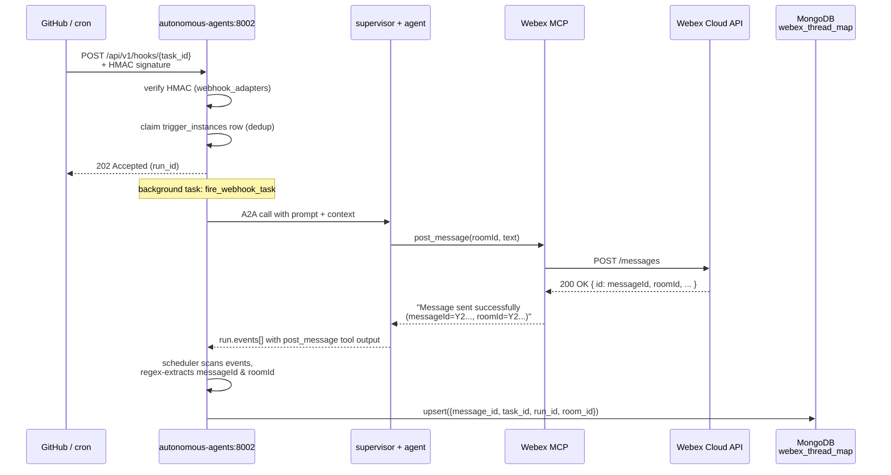
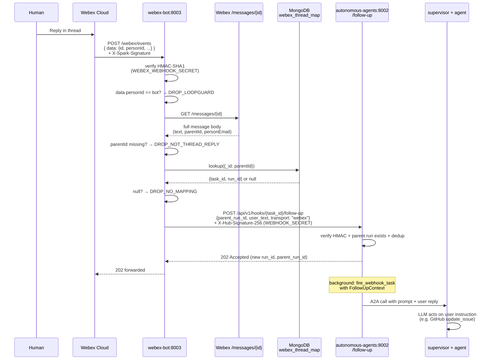

### Outbound: a task posts to Webex

```mermaid
sequenceDiagram
    participant Sender as GitHub / cron
    participant AA as autonomous-agents:8002
    participant Sup as supervisor + agent
    participant MCP as Webex MCP
    participant Wx as Webex Cloud API
    participant Mongo as MongoDB<br/>webex_thread_map

    Sender->>AA: POST /api/v1/hooks/{task_id}<br/>+ HMAC signature
    AA->>AA: verify HMAC (webhook_adapters)
    AA->>AA: claim trigger_instances row (dedup)
    AA-->>Sender: 202 Accepted (run_id)
    Note over AA: background task: fire_webhook_task
    AA->>Sup: A2A call with prompt + context
    Sup->>MCP: post_message(roomId, text)
    MCP->>Wx: POST /messages
    Wx-->>MCP: 200 OK { id: messageId, roomId, ... }
    MCP-->>Sup: "Message sent successfully<br/>(messageId=Y2..., roomId=Y2...)"
    Sup-->>AA: run.events[] with post_message tool output
    AA->>AA: scheduler scans events,<br/>regex-extracts messageId & roomId
    AA->>Mongo: upsert({message_id, task_id, run_id, room_id})
```

### Inbound: a human replies in the Webex thread

```mermaid
sequenceDiagram
    participant Human
    participant Wx as Webex Cloud
    participant Bot as webex-bot:8003
    participant WxAPI as Webex /messages/{id}
    participant Mongo as MongoDB<br/>webex_thread_map
    participant AA as autonomous-agents:8002<br/>/follow-up
    participant Sup as supervisor + agent

    Human->>Wx: Reply in thread
    Wx->>Bot: POST /webex/events<br/>{ data: {id, personId, ...} }<br/>+ X-Spark-Signature
    Bot->>Bot: verify HMAC-SHA1<br/>(WEBEX_WEBHOOK_SECRET)
    Bot->>Bot: data.personId == bot? → DROP_LOOPGUARD
    Bot->>WxAPI: GET /messages/{id}
    WxAPI-->>Bot: full message body<br/>(text, parentId, personEmail)
    Bot->>Bot: parentId missing? → DROP_NOT_THREAD_REPLY
    Bot->>Mongo: lookup({_id: parentId})
    Mongo-->>Bot: {task_id, run_id} or null
    Bot->>Bot: null? → DROP_NO_MAPPING
    Bot->>AA: POST /api/v1/hooks/{task_id}/follow-up<br/>{parent_run_id, user_text, transport: "webex"}<br/>+ X-Hub-Signature-256 (WEBHOOK_SECRET)
    AA->>AA: verify HMAC + parent run exists + dedup
    AA-->>Bot: 202 Accepted (new run_id, parent_run_id)
    Bot-->>Wx: 202 forwarded
    Note over AA: background: fire_webhook_task<br/>with FollowUpContext
    AA->>Sup: A2A call with prompt + user reply
    Sup->>Sup: LLM acts on user instruction<br/>(e.g. GitHub update_issue)
```
